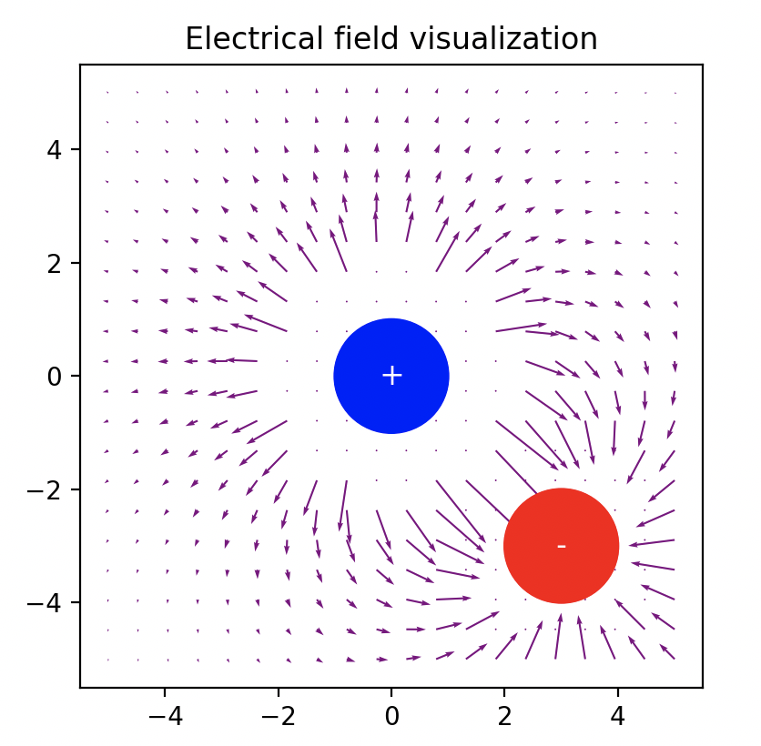
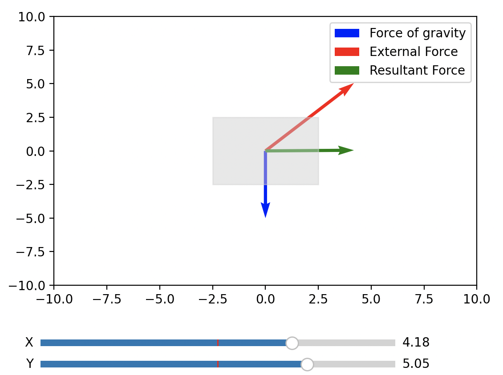

# Physics Repository

This is a free repository with the aim to create usefull interactive python scripts well commented and explained in order to better understand physics topics

 

## Rules

The aim is to create interactive python scripts via sliders or any other GUI that can be used in an interactive way to deeply understand the specific topic. 

Example GUI:
 

Any description on the topic covered in the script can be added

## Structure

The topics already studied correspond to their python script name. Here there is the list:

- angular-momentum.py
- archimede.py
- circular-motion.py
- diffraction.ipynb
- electrical-field.py
- electrical-force-attraction.py
- electrical-force-repulsion.py
- electromagnetic-field.py
- force.py
- gravitational-field.py
- gravitational-force.py
- hydrostatic-pressure.py
- interference.py
- kinetic-energy.py
- magnetic-field.py
- magnetic-force.py
- momentum.py
- potential-energy.py
- reflection.py
- refraction.py
- torque.py
- trajectory-velocity-acceleration.py
- wave-controller.py
- work.py

All the images needed are in the folder:

* images/

## Collaboration

Feel free to update the repository by improving the explainability of the existing scripts, or add new scripts that show a new topic.
